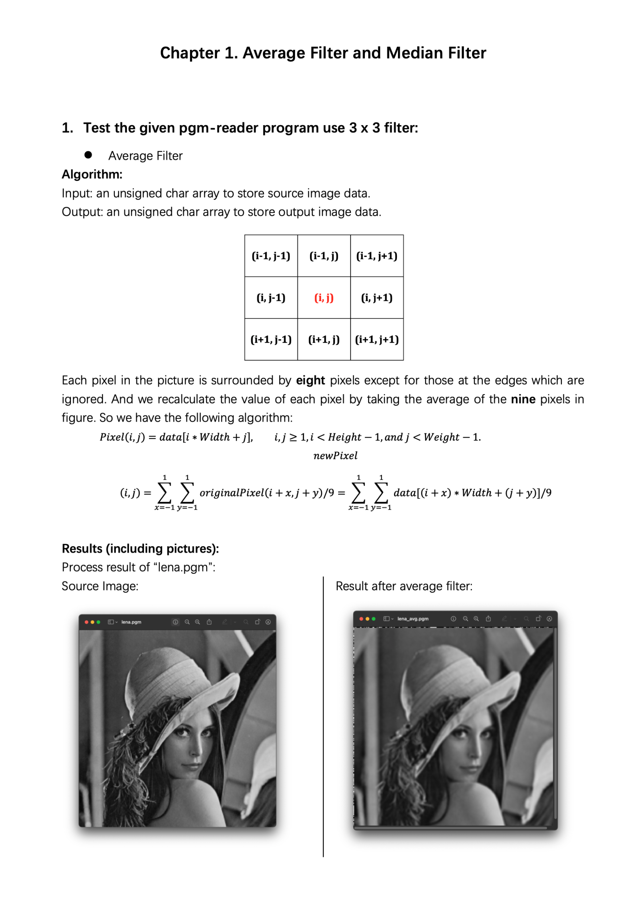

Digital Image Processing
========================

Chapter 1. Average Filter and Median Filter
-------------------------------------------

* Source Code available [here](https://github.com/Wilson-ZheLin/Introduction-to-Digital-Image-Processing/blob/main/1.%20Average%20Filter%20and%20Median%20Filter/src/main.cpp)

* Report with qualitative comparsion available [here](https://github.com/Wilson-ZheLin/Introduction-to-Digital-Image-Processing/blob/main/1.%20Average%20Filter%20and%20Median%20Filter/Chapter%201.%20Average%20Filter%20and%20Median%20Filter.pdf)

### Report Preview：

