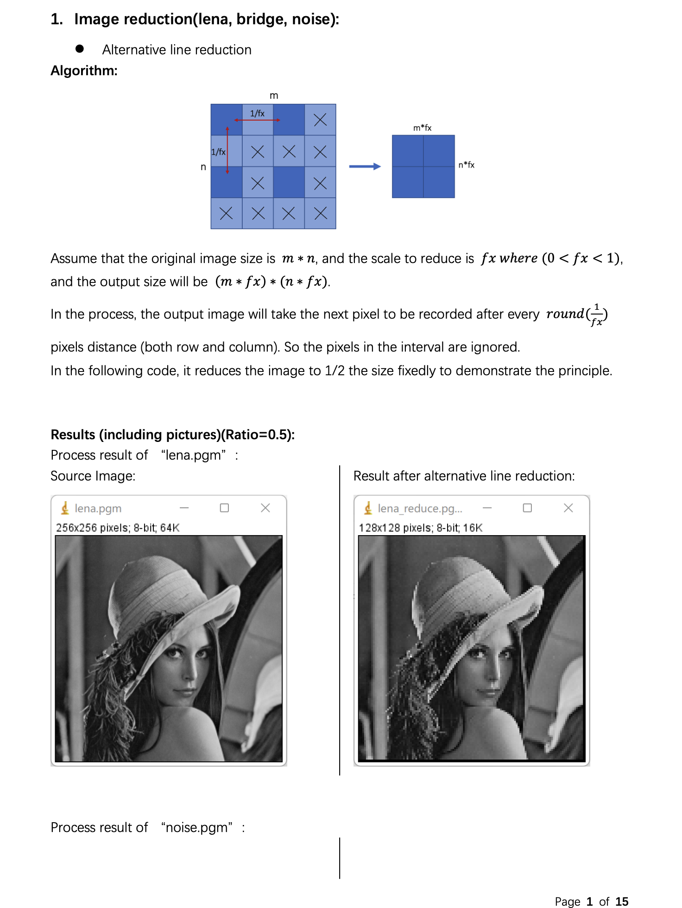

Digital Image Processing
========================

Chapter 2. Image Reduction, Enlargement and Negative
----------------------------------------------------

* Source Code available [here](https://github.com/Wilson-ZheLin/Introduction-to-Digital-Image-Processing/blob/main/2.%20Image%20Reduction%2C%20Enlargement%20and%20Negative/src/main.cpp)

* Report with qualitative comparsion available [here](https://github.com/Wilson-ZheLin/Introduction-to-Digital-Image-Processing/blob/main/2.%20Image%20Reduction%2C%20Enlargement%20and%20Negative/2.%20Image%20Reduction%2C%20Enlargement%20and%20Negative.pdf)

### Report Preview：

