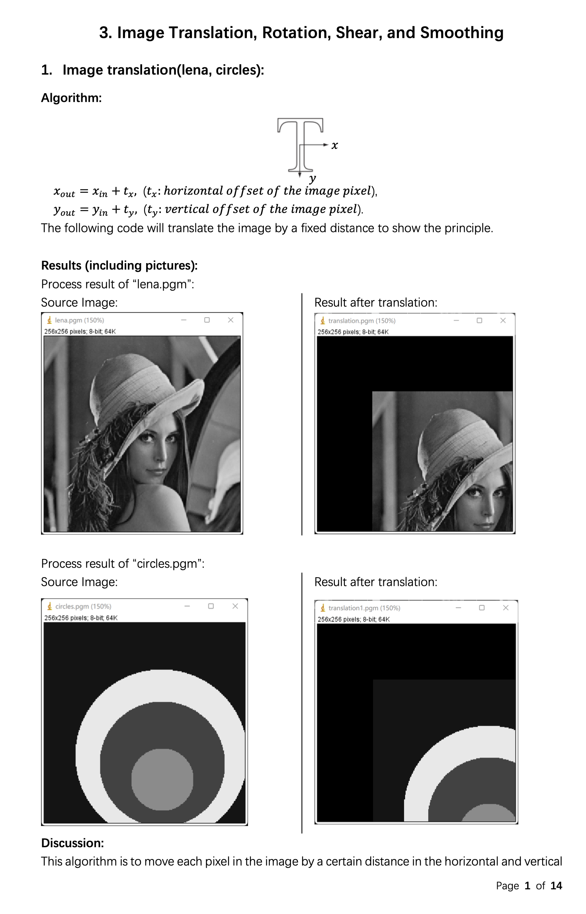

Digital Image Processing
========================

3. Affine Transformation and Smoothing
--------------------------------------

* Source Code available [here](https://github.com/Wilson-ZheLin/Introduction-to-Digital-Image-Processing/blob/main/3.%20Affine%20Transformation%20and%20Smoothing/src/main.cpp)

* Report with qualitative comparsion available [here](https://github.com/Wilson-ZheLin/Introduction-to-Digital-Image-Processing/blob/main/3.%20Affine%20Transformation%20and%20Smoothing/3.%20Affine%20Transformation%20and%20Smoothing.pdf)

### Report Preview：

