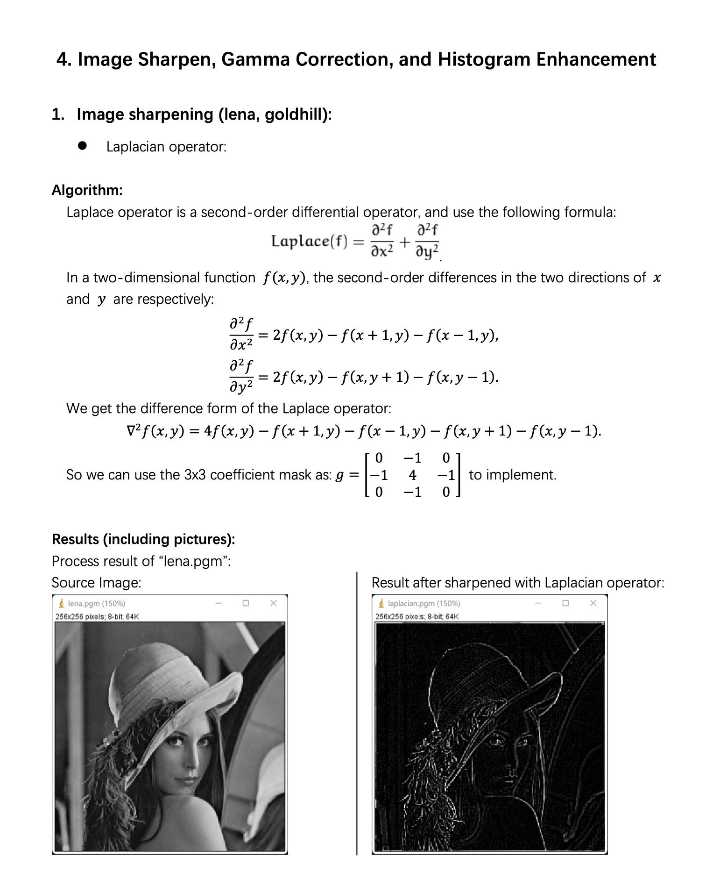

Digital Image Processing Tutorial (Chapter 4)
=============================================

👋 Hello and Welcome! 

 You've stumbled upon an beginner-friendly yet in-depth tutorial for **Digital Image Processing**. This repository is perfect for beginners and anyone curious about the inner workings of image processing techniques. While packages like `OpenCV` make these methods easily accessible, understanding the mechanics behind them can be both fascinating and enriching.


Chapter 4. Edge Detection and Grayscale Transformation
------------------------------------------------------

* Source Code available [here](https://github.com/Wilson-ZheLin/Introduction-to-Digital-Image-Processing/blob/main/4.%20Edge%20Detection%20and%20Grayscale%20Transformation/src/main.cpp)

* Report with qualitative comparsion available [here](https://github.com/Wilson-ZheLin/Introduction-to-Digital-Image-Processing/blob/main/4.%20Edge%20Detection%20and%20Grayscale%20Transformation/4.%20Image%20Sharpen%2C%20Gamma%20Correction%2C%20and%20Histogram%20Enhancement.pdf)


Getting Started
---------------
### For MacOS:

To ensure compatibility with MacOS, update the **memory allocation header** `#include <mm_malloc.h>` to `#include <malloc.h>`:

```
#include <malloc.h>
```

### For Windows:

Windows users can retain the existing **memory allocation header**:

```
#include <mm_malloc.h>
```


### Configuring Input/Output Paths

1. **Set Input Path:** In the `main()` function, update the input image path according to your requirements.

2. **Enable Desired Functions:** In `TestReadImage()`, uncomment the functions you wish to use for image processing. Each function is documented for easy reference.

3. **Execute the Program:** Run your program to see the results.


Tutorial Preview：
-----------------


