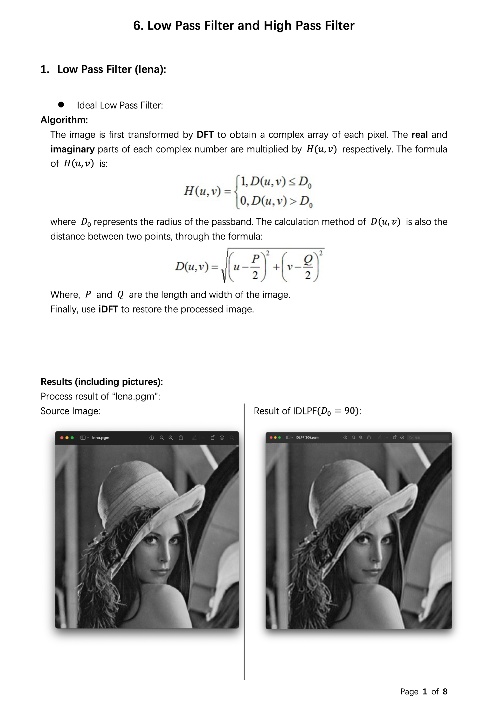

Digital Image Processing
========================

Chapter 6. Low Pass Filter and High Pass Filter
-----------------------------------------------

* Source Code available [here](https://github.com/Wilson-ZheLin/Introduction-to-Digital-Image-Processing/blob/main/6.%20Low%20Pass%20Filter%20and%20High%20Pass%20Filter/src/main.cpp)

* Report with qualitative comparsion available [here](https://github.com/Wilson-ZheLin/Introduction-to-Digital-Image-Processing/blob/main/6.%20Low%20Pass%20Filter%20and%20High%20Pass%20Filter/6.%20Low%20Pass%20Filter%20and%20High%20Pass%20Filter.pdf)

### Report Preview：

