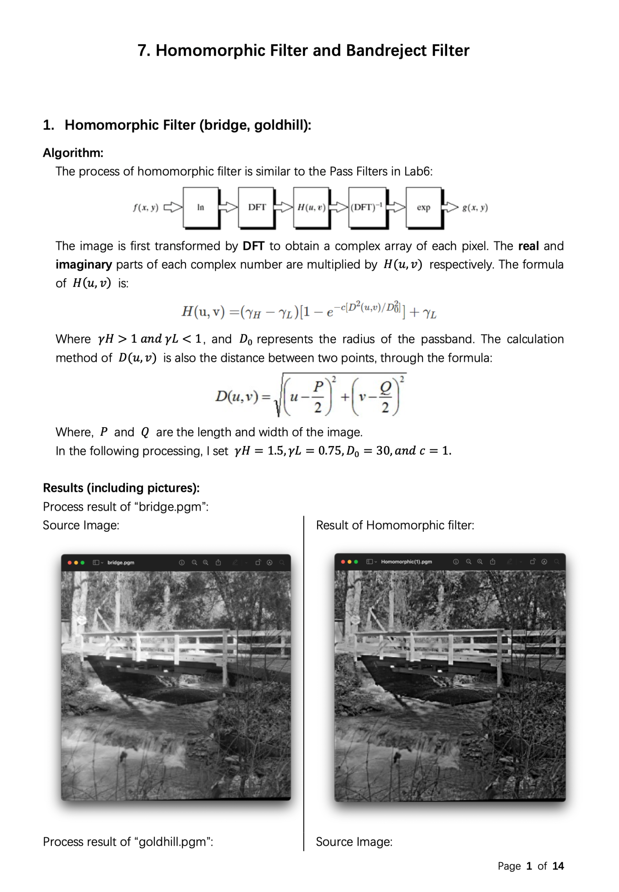

Digital Image Processing
========================

Chapter 7. Noise and Noise Reduction, Homomorphic and Band Stop Filter
----------------------------------------------------------------------

* Source Code available [here](https://github.com/Wilson-ZheLin/Introduction-to-Digital-Image-Processing/blob/main/7.%20Image%20Noise%20and%20Noise%20Reduction%2C%20Homomorphic%20Filter%2C%20and%20Band%20Stop%20Filter/src/main.cpp)

* Report with qualitative comparsion available [here](https://github.com/Wilson-ZheLin/Introduction-to-Digital-Image-Processing/blob/main/7.%20Image%20Noise%20and%20Noise%20Reduction%2C%20Homomorphic%20Filter%2C%20and%20Band%20Stop%20Filter/7.%20Image%20Noise%20and%20Noise%20Reduction%2C%20Homomorphic%20Filter%2C%20and%20Band%20Stop%20Filter.pdf)

### Report Preview：

