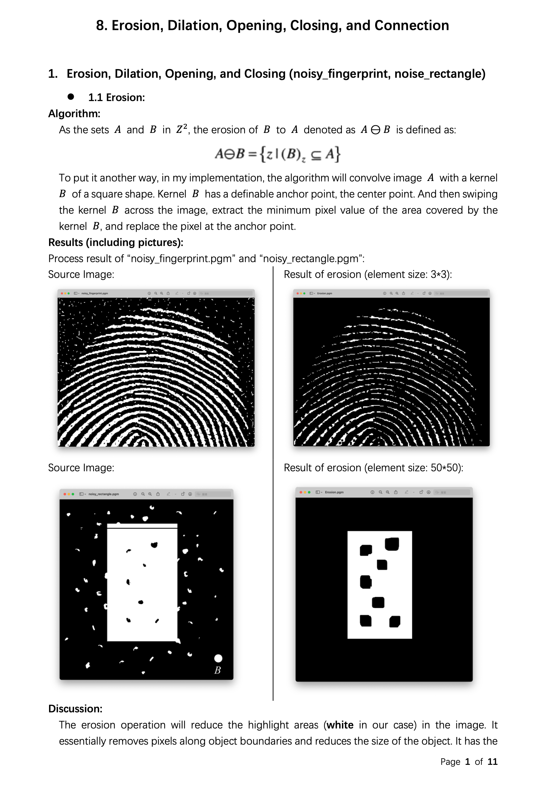

Digital Image Processing
========================

Chapter 8. Erosion, Dilation, Opening and Closing Operations, Boundary Extraction and Connection
------------------------------------------------------------------------------------------------

* Source Code available [here](https://github.com/Wilson-ZheLin/Introduction-to-Digital-Image-Processing/blob/main/8.%20Erosion%2C%20Dilation%2C%20Opening%20and%20Closing%20Operations%2C%20Boundary%20Extraction%20and%20Connection/src/main.cpp)

* Report with qualitative comparsion available [here](https://github.com/Wilson-ZheLin/Introduction-to-Digital-Image-Processing/blob/main/8.%20Erosion%2C%20Dilation%2C%20Opening%20and%20Closing%20Operations%2C%20Boundary%20Extraction%20and%20Connection/8.%20Erosion%2C%20Dilation%2C%20Opening%20and%20Closing%20Operations%2C%20Boundary%20Extraction%20and%20Connection.pdf)

### Report Preview：

